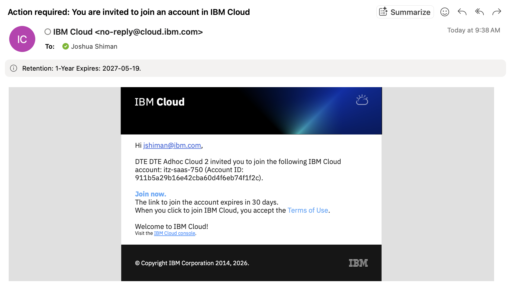
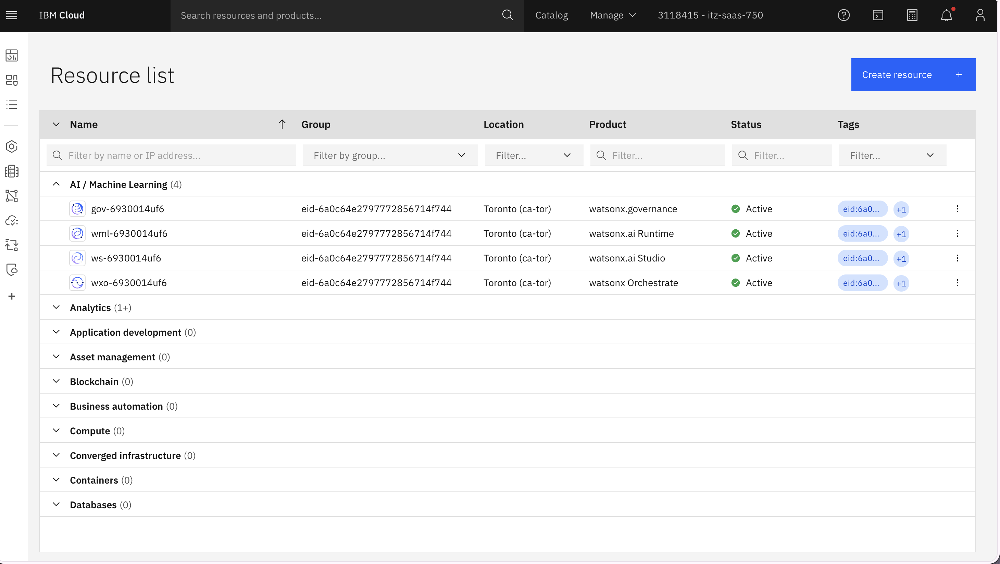
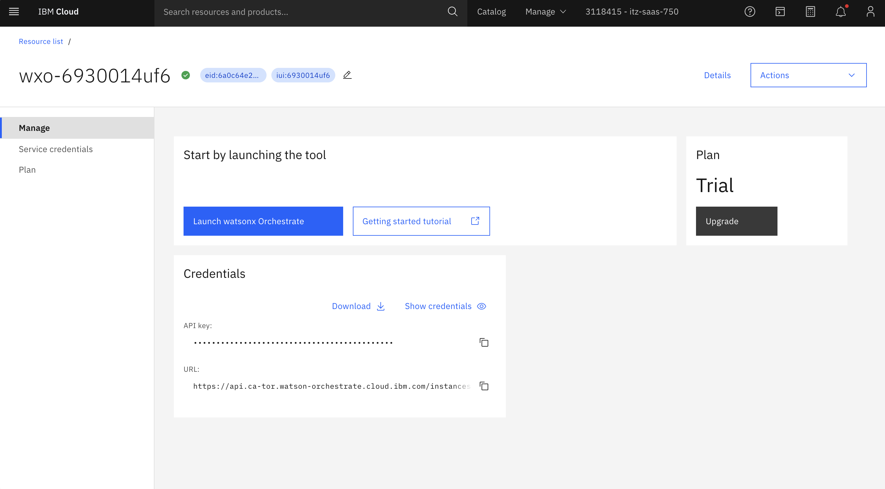

# Lab 1: Environment Setup

**Duration:** 30 minutes  
**Objective:** Set up your development environment and obtain API credentials

---

## Overview

In this lab, you'll:
1. Get workshop materials from Box
2. Join IBM Cloud and get watsonx Orchestrate credentials
3. Configure your environment
4. Test your connections

---

## Part 1: Get Workshop Materials (5 min)

### Step 1: Access Box Folder

You'll receive a Box folder link containing:
- Workshop repository (ZIP file)
- One-pager documentation (PDF)
- Confluent Kafka API credentials (text file)

**Action Items:**
1. Open the Box folder link provided by your instructor
2. Download all files to your computer
3. Extract the workshop repository ZIP file
4. Save the Kafka API credentials - you'll need them soon

---

## Part 2: Join IBM Cloud & Get Orchestrate Credentials (10 min)

### Step 1: Accept IBM Cloud Invitation

You'll receive an email invitation to join an IBM Cloud account.



**Action Items:**
1. Check your email for the IBM Cloud invitation
2. Click **"Join now"** in the email
3. Accept the terms and conditions
4. You'll be redirected to the IBM Cloud home page

### Step 2: Navigate to Resource List

Once logged into IBM Cloud:



**Action Items:**
1. Click the **hamburger menu** (☰) in the top-left corner
2. Select **"Resource list"** from the sidebar
3. You'll see a list of available resources

### Step 3: Get watsonx Orchestrate Credentials



**Action Items:**
1. Find **"watsonx Orchestrate"** in your resource list
2. Click on the watsonx Orchestrate instance
3. Click **"Full details"** or **"View credentials"**
4. Copy and save:
   - **API URL** (e.g., `https://your-instance.watson-orchestrate.ibm.com`)
   - **API Key** (long string starting with letters and numbers)

> 💡 **Tip:** Keep these credentials in a safe place - you'll need them in the next step!

---

## Part 3: Set Up Python Environment (10 min)

### Step 1: Check Python Version

This workshop requires **Python 3.11** for compatibility with both Kafka and watsonx Orchestrate.

Check your Python version:

```bash
python --version
```

or

```bash
python3 --version
```

**Required:** Python 3.11.x

### Step 2: Install Python 3.11 (if needed)

If you don't have Python 3.11, install it:

**macOS (using Homebrew):**
```bash
brew install python@3.11
```

**Windows:**
1. Download Python 3.11 from [python.org](https://www.python.org/downloads/)
2. Run the installer
3. ✅ Check "Add Python to PATH"

**Linux (Ubuntu/Debian):**
```bash
sudo apt update
sudo apt install python3.11 python3.11-venv
```

### Step 3: Navigate to Workshop Directory

Open your terminal and navigate to the workshop folder:

```bash
cd path/to/workshop
```

### Step 4: Create Virtual Environment

Create an isolated Python environment for the workshop:

```bash
python3.11 -m venv venv
```

> 💡 **What is a virtual environment?** It keeps your workshop dependencies separate from your system Python, preventing conflicts.

### Step 5: Activate Virtual Environment

**macOS/Linux:**
```bash
source venv/bin/activate
```

**Windows (Command Prompt):**
```bash
venv\Scripts\activate
```

**Windows (PowerShell):**
```bash
venv\Scripts\Activate.ps1
```

**Expected Result:** Your terminal prompt should now show `(venv)` at the beginning:
```
(venv) user@computer:~/workshop$
```

> ⚠️ **Important:** Keep this terminal window open and the virtual environment activated for all workshop labs!

---

## Part 4: Configure Your Environment (5 min)

### Step 1: Create Environment File

Copy the example environment file:

```bash
cp .env.example .env
```

### Step 3: Edit Configuration

Open `.env` in your text editor and fill in your credentials:

```bash
# Confluent Kafka Configuration (from Box folder)
KAFKA_BOOTSTRAP_SERVERS=your-cluster.confluent.cloud:9092
KAFKA_SASL_USERNAME=your-api-key
KAFKA_SASL_PASSWORD=your-api-secret

# Kafka Topics (already configured)
WEATHER_TOPIC=weather_events
FLIGHT_TOPIC=flight_telemetry

# watsonx Orchestrate Configuration (from IBM Cloud)
ORCHESTRATE_API_URL=https://your-instance.watson-orchestrate.ibm.com
ORCHESTRATE_API_KEY=your-orchestrate-api-key

# API Configuration (leave as-is)
API_HOST=0.0.0.0
API_PORT=8000
```

**Where to find each value:**

| Variable | Source | Example |
|----------|--------|---------|
| `KAFKA_BOOTSTRAP_SERVERS` | Box folder - Kafka credentials file | `pkc-xxxxx.us-east-1.aws.confluent.cloud:9092` |
| `KAFKA_SASL_USERNAME` | Box folder - Kafka credentials file | `ABCDEFGHIJKLMNOP` |
| `KAFKA_SASL_PASSWORD` | Box folder - Kafka credentials file | `long-secret-string` |
| `ORCHESTRATE_API_URL` | IBM Cloud - watsonx Orchestrate details | `https://us-south.ml.cloud.ibm.com/...` |
| `ORCHESTRATE_API_KEY` | IBM Cloud - watsonx Orchestrate details | `abc123xyz...` |

### Step 2: Install Python Dependencies

Make sure your virtual environment is activated (you should see `(venv)` in your prompt), then install all required packages:

```bash
pip install -r requirements.txt
```

> ⏱️ **Note:** This may take 2-3 minutes to complete.

**What's being installed:**
- **IBM watsonx Orchestrate ADK** - For building AI agents
- **Kafka clients** - For streaming data
- **Flask & Flask-CORS** - For the API server (Lab 4)
- **FastAPI** - Alternative web framework
- **Other utilities** - python-dotenv, requests, etc.

**Expected Output:**
```
Successfully installed ibm-watsonx-orchestrate-2.8.0 confluent-kafka-2.3.0 flask-3.0.0 ...
```

---

## Part 5: Test Your Connections (5 min)

### Test Kafka Connection

Run the Kafka connection test:

```bash
python backend/kafka_utils.py
```

**Expected Output:**
```
✅ Kafka connection successful!
```

**If you see an error:**
- Double-check your Kafka credentials in `.env`
- Ensure `KAFKA_BOOTSTRAP_SERVERS` includes the port (`:9092`)
- Verify there are no extra spaces in your credentials

### Test Python Environment

Verify Python packages are installed:

```bash
python -c "import kafka; import fastapi; print('✅ All packages installed!')"
```

**Expected Output:**
```
✅ All packages installed!
```

---

## Troubleshooting

### Issue: Wrong Python version

**Solution:**
```bash
# Deactivate current environment
deactivate

# Remove old venv
rm -rf venv

# Create new venv with Python 3.11
python3.11 -m venv venv

# Activate and reinstall
source venv/bin/activate  # or venv\Scripts\activate on Windows
pip install -r requirements.txt
```

### Issue: "Module not found" error

**Solution:**
```bash
# Make sure venv is activated
source venv/bin/activate  # or venv\Scripts\activate on Windows

# Reinstall packages
pip install -r requirements.txt --upgrade
```

### Issue: Virtual environment not activating on Windows PowerShell

**Solution:**
```powershell
# Enable script execution
Set-ExecutionPolicy -ExecutionPolicy RemoteSigned -Scope CurrentUser

# Then activate
venv\Scripts\Activate.ps1
```

### Issue: Kafka connection fails

**Checklist:**
- [ ] Credentials copied correctly (no extra spaces)
- [ ] Bootstrap server includes port number
- [ ] Using the correct credentials from Box folder
- [ ] Internet connection is stable

### Issue: Can't find watsonx Orchestrate in IBM Cloud

**Solution:**
- Refresh the resource list page
- Check that you accepted the IBM Cloud invitation
- Contact your instructor if the resource isn't visible

---

## Verification Checklist

Before moving to Lab 2, ensure you have:

- [ ] Downloaded workshop materials from Box
- [ ] Joined IBM Cloud account
- [ ] Obtained watsonx Orchestrate credentials
- [ ] Installed Python 3.11
- [ ] Created and activated virtual environment (see `(venv)` in prompt)
- [ ] Created and configured `.env` file
- [ ] Installed Python dependencies
- [ ] Successfully tested Kafka connection
- [ ] Verified Python packages are installed

> 💡 **Remember:** Always activate your virtual environment (`source venv/bin/activate`) before running workshop commands!

---

## Next Steps

✅ **Congratulations!** Your environment is set up and ready.

Proceed to **Lab 2: Kafka Consumer** to start building your aviation warning system!

---

## Quick Reference

**Important Files:**
- `.env` - Your configuration file (keep this private!)
- `requirements.txt` - Python dependencies
- `backend/kafka_utils.py` - Kafka helper functions

**Need Help?**
- Check the troubleshooting section above
- Ask your instructor
- Review the example files in `examples/`

---

**Lab 1 Complete!** 🎉