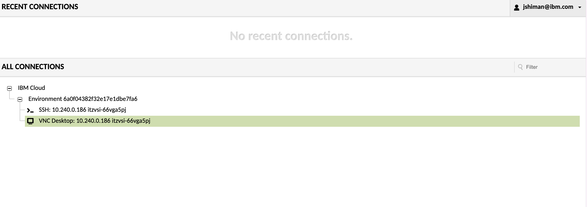

# Lab 1: Environment Setup

**Duration:** 45 minutes
**Objective:** Set up your development environment and obtain API credentials

---

## Overview

In this lab, you'll:
1. Create an IBM ID (if you don't have one)
2. Access your IBM TechZone VMs
3. Get workshop materials from Box
4. Join IBM Cloud and get watsonx Orchestrate credentials
5. Configure your environment
6. Test your connections

---

## Part 0: Prerequisites - IBM ID & TechZone Setup (10 min)

### Step 1: Create an IBM ID

If you don't already have an IBM ID, you'll need to create one using your work email address.

**Action Items:**

1. Navigate to the IBM ID creation page:
   **[https://myibm.ibm.com](https://myibm.ibm.com)** (right-click to open in a new tab)

2. Click **"Create an IBMid"**

3. Enter your information:
   - **Email address:** Use your work email
   - **Password:** Create a secure password
   - **First and Last Name**
   - **Country/Region**

4. Click **"Next"**

5. Check your email for a confirmation code from `ibmacct@iam.ibm.com`

6. Copy the **7-digit verification token** from the email

7. Paste the verification code and click **"Create Account"**

8. Accept the IBM Account Privacy notification by clicking **"Proceed"**

> ✅ **Success!** Your IBM ID is now active and ready to use.

---

### Step 2: Access IBM TechZone VMs

You will receive **two separate emails** from IBM TechZone for your workshop environments:

#### Email 1: IBM watsonx Orchestrate VM

You'll receive an email titled **"Join cloud account"** with an invitation to access the watsonx Orchestrate environment.


**Action Items:**
1. Open the email from IBM TechZone
2. Click **"Join now"** or the invitation link
3. Accept the terms and conditions
4. You'll be redirected to IBM Cloud (continue to Part 2 below)

> 💡 **Note:** This email gives you access to the watsonx Orchestrate instance you'll use in the workshop.

---

#### Email 2: IBM Cloud VSI for IBM Bob IDE

You'll receive a second email titled **"Your environment is ready"** for the IBM Bob IDE virtual machine.


**Action Items:**

1. Open the **"Your environment is ready"** email from IBM TechZone

2. Click the link to go to your **TechZone Requests page**


3. On the requests page, scroll down to find your reservation:
   - Look for **"IBM Cloud VSI for IBM Bob IDE"**
   - Click to **expand** the reservation details

4. Find the **VDI (Virtual Desktop Interface) link** in the expanded section


5. Click the VDI link to access the **Guacamole VM**

> 💡 **What is Guacamole?** It's a browser-based remote desktop that lets you access your development VM without installing any software.

---

### Step 3: Configure Guacamole Access

Once the Guacamole page loads, you'll need to enable clipboard access and connect to your desktop.

#### Enable Clipboard Access

**IMPORTANT:** Allow clipboard access so you can copy/paste between your local machine and the VM.

When the Guacamole page loads, look at the **top of your browser** for a clipboard permission prompt.


**Google Chrome:**
1. Look for the clipboard icon in the address bar (right side)
2. Click the icon
3. Select **"Allow"** for clipboard access
4. Alternatively: Click the lock icon → Site settings → Clipboard → Allow

**Microsoft Edge:**
1. Look for the clipboard icon in the address bar (right side)
2. Click the icon
3. Select **"Allow"** for clipboard access
4. Alternatively: Click the lock icon → Permissions for this site → Clipboard → Allow

**Mozilla Firefox:**
1. Look for the clipboard icon in the address bar (left side)
2. Click the icon
3. Select **"Allow"** for clipboard access
4. Alternatively: Click the shield icon → Permissions → Use the Clipboard → Allow

**Safari:**
1. Safari → Settings → Websites → Clipboard
2. Find the Guacamole site and set to **"Allow"**

> ⚠️ **Important:** Without clipboard access, you won't be able to copy/paste credentials and code between your computer and the VM!

---

#### Connect to Your Desktop

After enabling clipboard access:



1. On the Guacamole page, look for **"All Connections"** section

2. Expand **"IBM Cloud"** by clicking on it

3. Expand your environment name (it will match your reservation)

4. Click on **"VNC Desktop"** to launch the virtual desktop

5. Wait for the desktop to load (this may take 10-30 seconds)

**Expected Result:** You should now see a full Linux desktop environment in your browser with IBM Bob IDE ready to use.

> 💡 **Tip:** If the connection fails, refresh the page and try again. The VM may need a moment to fully start up.

**You now have access to:**
- ✅ IBM Cloud account with watsonx Orchestrate
- ✅ IBM Bob IDE virtual machine via Guacamole
- ✅ Clipboard access for easy copy/paste

> ⚠️ **Important:** Keep both emails handy - you'll need the credentials and links throughout the workshop!

---

### Step 4: Navigate the RHEL Desktop

You're now in a Red Hat Enterprise Linux (RHEL) desktop environment. Here are the basics:

#### Copy & Paste in the VM

**To copy text:**
- **Inside the VM:** `Ctrl+C` (standard)
- **From your computer to VM:** Copy on your computer (`Ctrl+C` or `Cmd+C`), then paste in VM with `Ctrl+Shift+V` or right-click → Paste

**To paste text:**
- **Inside the VM:** `Ctrl+V` (standard)
- **From VM to your computer:** Copy in VM (`Ctrl+C`), then paste on your computer (`Ctrl+V` or `Cmd+V`)

#### Basic Navigation

**Activities Menu:**
- Click **"Activities"** in the top-left corner to access applications
- Or press the **Super key** (Windows key / Command key)
- Search for applications by typing their name

**Common Applications:**
- **Firefox** - Web browser (pre-installed)
- **Terminal** - Command line interface
- **Files** - File manager

---

### Step 5: Authenticate IBM Bob IDE

Now you'll set up Bob IDE, your AI-powered development environment.

#### Open Bob IDE

1. Click **"Activities"** in the top-left corner

2. Type **"Bob"** in the search bar

3. Click on the **Bob IDE** application to launch it

4. Bob will open with a login panel on the right side

#### Authenticate with IBM ID

1. In Bob's right-hand panel, click **"Sign in"** or **"Authenticate"**

2. Bob will open a link in **Firefox** (the default browser in the VM)

3. On the IBM login page, enter your **IBM ID credentials**:
   - Email: Your work email (the one you used to create your IBM ID)
   - Password: Your IBM ID password

4. Complete any two-factor authentication if prompted

5. After successful login, you'll see a prompt: **"Open in Bob?"**

6. Click **"Open in Bob"** or **"Allow"**

7. You'll be redirected back to Bob IDE, now authenticated

**Expected Result:** Bob IDE is now authenticated and ready to use!

> 💡 **Tip:** If the browser doesn't open automatically, look for a URL in Bob's output panel and copy it to Firefox manually.

---

## Part 1: Get Workshop Materials (5 min)

### Step 1: Access Box Folder in the VM

Now that Bob is authenticated, you'll download the workshop materials.

#### Open Firefox and Access Box

1. In the VM, click **"Activities"** → type **"Firefox"** → open Firefox

2. Navigate to the workshop Box folder:
   ```
   https://ibm.box.com/v/navcanworkshop
   ```

3. Enter the **password** provided by your instructor

4. You'll see the workshop materials:
   - Workshop repository (ZIP file)
   - Confluent Kafka API credentials (text file)
   - One-pager documentation (PDF)

#### Download and Extract Materials

1. **Download the workshop repository ZIP file** to your VM

2. **Download the Kafka credentials file** - you'll need this soon

3. Once downloaded, open the **Files** application (Activities → Files)

4. Navigate to **Downloads** folder

5. **Right-click** on the workshop ZIP file → **"Extract Here"**

6. You should now see an extracted workshop folder

---

### Step 2: Open Workshop in Bob IDE

Now you'll open the workshop project in Bob IDE (similar to VS Code).

#### Open Folder in Bob

1. Switch back to **Bob IDE**

2. Click **"File"** in the top menu → **"Open Folder"**
   - Or use keyboard shortcut: `Ctrl+K` then `Ctrl+O`

3. Navigate to your **Downloads** folder

4. Select the **extracted workshop folder**

5. Click **"Open"** or **"Select Folder"**

**Expected Result:** The workshop project is now open in Bob IDE with the file explorer visible on the left side.

> 💡 **Tip:** You can also drag and drop the folder from Files into Bob IDE to open it.

#### Verify Workshop Files

In Bob's file explorer (left sidebar), you should see:
- `workshop/` - Your working directory
- `reference-implementation/` - Complete examples
- `labs/` - Lab instructions
- `requirements.txt` - Python dependencies
- `.env.example` - Configuration template
- `README.md` - Project documentation

> ✅ **Success!** You now have the workshop materials open in Bob IDE and are ready to start coding!

---

## Part 2: Join IBM Cloud & Get Orchestrate Credentials (10 min)

### Step 1: Accept IBM Cloud Invitation

You'll receive an email invitation to join an IBM Cloud account.


**Action Items:**
1. Check your email for the IBM Cloud invitation
2. Click **"Join now"** in the email
3. Accept the terms and conditions
4. You'll be redirected to the IBM Cloud home page

### Step 2: Navigate to Resource List

Once logged into IBM Cloud:


**Action Items:**
1. Click the **hamburger menu** (☰) in the top-left corner
2. Select **"Resource list"** from the sidebar
3. You'll see a list of available resources

### Step 3: Get watsonx Orchestrate Credentials


**Action Items:**
1. Find **"watsonx Orchestrate"** in your resource list
2. Click on the watsonx Orchestrate instance
3. Click **"Full details"** or **"View credentials"**
4. Copy and save:
   - **API URL** (e.g., `https://your-instance.watson-orchestrate.ibm.com`)
   - **API Key** (long string starting with letters and numbers)

> 💡 **Tip:** Keep these credentials in a safe place - you'll need them in the next step!

---

## Part 3: Set Up Python Environment in the VM (10 min)

### Step 1: Open Terminal in Bob IDE

In your Bob IDE window:

1. Click the **three dots (⋮)** in the top-right corner of Bob IDE
2. Select **"Terminal"** from the dropdown menu
3. Click **"New Terminal"**
   - Alternative: Use keyboard shortcut `Ctrl+Shift+` (backtick)

4. A terminal panel will open at the bottom of Bob IDE

**Expected Result:** You should see a bash terminal prompt in the RHEL VM.

### Step 2: Check Python Version

The RHEL VM comes with Python pre-installed. Verify the version:

```bash
python3 --version
```

**Expected Output:** Python 3.11.x (or compatible version)

> 💡 **Note:** The VM is pre-configured with Python 3.11 for the workshop.

### Step 3: Navigate to Workshop Directory

In the Bob IDE terminal, navigate to the workshop folder:

```bash
cd ~/Downloads/bobathon-agentic-aviation-weather-warning-application/workshop
```

> 💡 **Tip:** Adjust the path if you extracted the workshop to a different location.

### Step 4: Create Virtual Environment

Create an isolated Python environment for the workshop:

```bash
python3 -m venv venv
```

> 💡 **What is a virtual environment?** It keeps your workshop dependencies separate from your system Python, preventing conflicts.

### Step 5: Activate Virtual Environment

In the RHEL VM terminal:

```bash
source venv/bin/activate
```

**Expected Result:** Your terminal prompt should now show `(venv)` at the beginning:
```
(venv) [user@hostname workshop]$
```

> ⚠️ **Important:** Keep this terminal open in Bob IDE and the virtual environment activated for all workshop labs!

---

<details>
<summary><b>Alternative: Running Locally (Optional - Not Recommended)</b></summary>

If you need to run the workshop on your local machine instead of the VM:

**macOS (using Homebrew):**
```bash
brew install python@3.11
python3.11 -m venv venv
source venv/bin/activate
```

**Windows:**
1. Download Python 3.11 from [python.org](https://www.python.org/downloads/)
2. Run the installer and check "Add Python to PATH"
3. Open Command Prompt or PowerShell:
```bash
python -m venv venv
venv\Scripts\activate  # Command Prompt
# OR
venv\Scripts\Activate.ps1  # PowerShell
```

**Linux (Ubuntu/Debian):**
```bash
sudo apt update
sudo apt install python3.11 python3.11-venv
python3.11 -m venv venv
source venv/bin/activate
```

</details>

---

## Part 4: Configure Your Environment (5 min)

### Step 1: Create Environment File

Copy the example environment file:

```bash
cp .env.example .env
```

### Step 3: Edit Configuration

Open `.env` in your text editor and fill in your credentials:

```bash
# Confluent Kafka Configuration (from Box folder)
KAFKA_BOOTSTRAP_SERVERS=your-cluster.confluent.cloud:9092
KAFKA_SASL_USERNAME=your-api-key
KAFKA_SASL_PASSWORD=your-api-secret

# Kafka Topics (already configured)
WEATHER_TOPIC=weather_events
FLIGHT_TOPIC=flight_telemetry

# watsonx Orchestrate Configuration (from IBM Cloud)
ORCHESTRATE_API_URL=https://your-instance.watson-orchestrate.ibm.com
ORCHESTRATE_API_KEY=your-orchestrate-api-key

# API Configuration (leave as-is)
API_HOST=0.0.0.0
API_PORT=8000
```

**Where to find each value:**

| Variable | Source | Example |
|----------|--------|---------|
| `KAFKA_BOOTSTRAP_SERVERS` | Box folder - Kafka credentials file | `pkc-xxxxx.us-east-1.aws.confluent.cloud:9092` |
| `KAFKA_SASL_USERNAME` | Box folder - Kafka credentials file | `ABCDEFGHIJKLMNOP` |
| `KAFKA_SASL_PASSWORD` | Box folder - Kafka credentials file | `long-secret-string` |
| `ORCHESTRATE_API_URL` | IBM Cloud - watsonx Orchestrate details | `https://us-south.ml.cloud.ibm.com/...` |
| `ORCHESTRATE_API_KEY` | IBM Cloud - watsonx Orchestrate details | `abc123xyz...` |

### Step 2: Install Python Dependencies

Make sure your virtual environment is activated (you should see `(venv)` in your prompt), then install all required packages:

```bash
pip install -r requirements.txt
```

> ⏱️ **Note:** This may take 2-3 minutes to complete.

**What's being installed:**
- **IBM watsonx Orchestrate ADK** - For building AI agents
- **Kafka clients** - For streaming data
- **Flask & Flask-CORS** - For the API server (Lab 4)
- **FastAPI** - Alternative web framework
- **Other utilities** - python-dotenv, requests, etc.

**Expected Output:**
```
Successfully installed ibm-watsonx-orchestrate-2.8.0 confluent-kafka-2.3.0 flask-3.0.0 ...
```

---

## Part 5: Test Your Connections (5 min)

### Test Kafka Connection

Run the Kafka connection test:

```bash
python backend/kafka_utils.py
```

**Expected Output:**
```
✅ Kafka connection successful!
```

**If you see an error:**
- Double-check your Kafka credentials in `.env`
- Ensure `KAFKA_BOOTSTRAP_SERVERS` includes the port (`:9092`)
- Verify there are no extra spaces in your credentials

### Test Python Environment

Verify Python packages are installed:

```bash
python -c "import kafka; import fastapi; print('✅ All packages installed!')"
```

**Expected Output:**
```
✅ All packages installed!
```

---

## Troubleshooting

### Issue: Can't access Guacamole VM

**Solution:**
- Verify you clicked the correct VDI link from TechZone
- Refresh the browser page
- Check that your TechZone reservation is active
- Contact your instructor if the VM isn't accessible

### Issue: Clipboard not working in VM

**Solution:**
- Ensure you allowed clipboard access in your browser (see Step 3)
- Try refreshing the Guacamole page
- Use `Ctrl+Shift+V` to paste into the VM terminal
- Check browser permissions: Settings → Site Settings → Clipboard

### Issue: Bob IDE won't authenticate

**Solution:**
- Make sure Firefox opened the authentication page
- If no browser opened, look for the URL in Bob's output panel
- Copy the URL and paste it into Firefox manually
- Clear Firefox cookies and try again: Settings → Privacy & Security → Clear Data

### Issue: Wrong Python version in VM

**Solution:**
```bash
# In Bob IDE terminal
# Deactivate current environment
deactivate

# Remove old venv
rm -rf venv

# Create new venv with Python 3
python3 -m venv venv

# Activate and reinstall
source venv/bin/activate
pip install -r requirements.txt
```

### Issue: "Module not found" error

**Solution:**
```bash
# In Bob IDE terminal
# Make sure venv is activated (you should see (venv) in prompt)
source venv/bin/activate

# Reinstall packages
pip install -r requirements.txt --upgrade
```

### Issue: Can't find workshop folder

**Solution:**
- Check your Downloads folder: `cd ~/Downloads`
- List files: `ls -la`
- If ZIP wasn't extracted: `unzip bobathon-*.zip`
- Navigate to extracted folder: `cd bobathon-agentic-aviation-weather-warning-application/workshop`

### Issue: Kafka connection fails

**Checklist:**
- [ ] Credentials copied correctly from Box folder (no extra spaces)
- [ ] Bootstrap server includes port number (`:9092`)
- [ ] Using the correct credentials from the Kafka credentials file
- [ ] VM has internet connectivity (test with `ping google.com`)
- [ ] `.env` file is in the correct directory

### Issue: Can't find watsonx Orchestrate in IBM Cloud

**Solution:**
- Open Firefox in the VM and go to IBM Cloud
- Refresh the resource list page
- Check that you accepted the IBM Cloud invitation email
- Contact your instructor if the resource isn't visible

---

<details>
<summary><b>Local Machine Troubleshooting (If Not Using VM)</b></summary>

### Issue: Virtual environment not activating on Windows PowerShell

**Solution:**
```powershell
# Enable script execution
Set-ExecutionPolicy -ExecutionPolicy RemoteSigned -Scope CurrentUser

# Then activate
venv\Scripts\Activate.ps1
```

### Issue: Python not found on macOS

**Solution:**
```bash
# Install Python 3.11 via Homebrew
brew install python@3.11

# Create venv
python3.11 -m venv venv
source venv/bin/activate
```

</details>

---

## Verification Checklist

Before moving to Lab 2, ensure you have:

- [ ] Created an IBM ID (or logged in with existing ID)
- [ ] Received and accessed both TechZone VM emails
- [ ] Accessed IBM Cloud via watsonx Orchestrate invitation
- [ ] Accessed IBM Bob IDE via Guacamole VDI link
- [ ] Downloaded workshop materials from Box
- [ ] Joined IBM Cloud account
- [ ] Obtained watsonx Orchestrate credentials
- [ ] Installed Python 3.11
- [ ] Created and activated virtual environment (see `(venv)` in prompt)
- [ ] Created and configured `.env` file
- [ ] Installed Python dependencies
- [ ] Successfully tested Kafka connection
- [ ] Verified Python packages are installed

> 💡 **Remember:** Always activate your virtual environment (`source venv/bin/activate`) before running workshop commands!

---

## Next Steps

✅ **Congratulations!** Your environment is set up and ready.

Proceed to **Lab 2: Kafka Consumer** to start building your aviation warning system!

---

## Quick Reference

**Important Files:**
- `.env` - Your configuration file (keep this private!)
- `requirements.txt` - Python dependencies
- `backend/kafka_utils.py` - Kafka helper functions

**Need Help?**
- Check the troubleshooting section above
- Ask your instructor
- Review the example files in `examples/`

---

**Lab 1 Complete!** 🎉