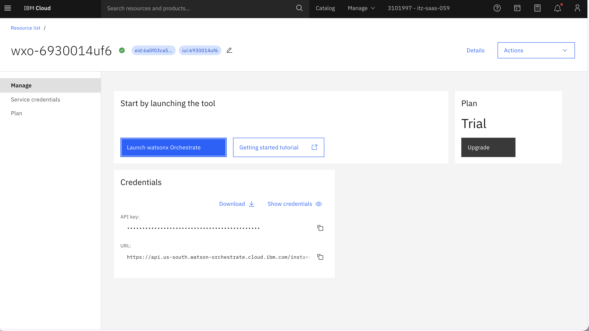
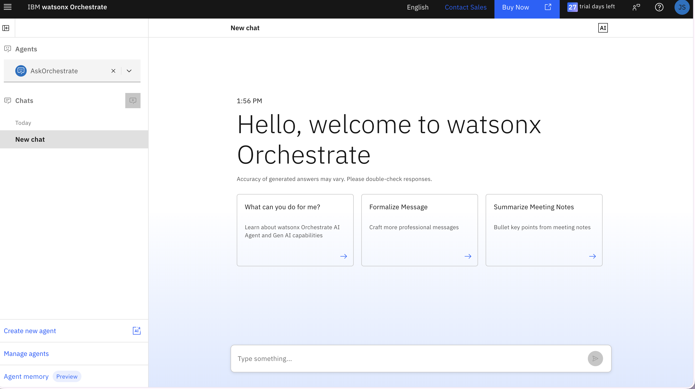
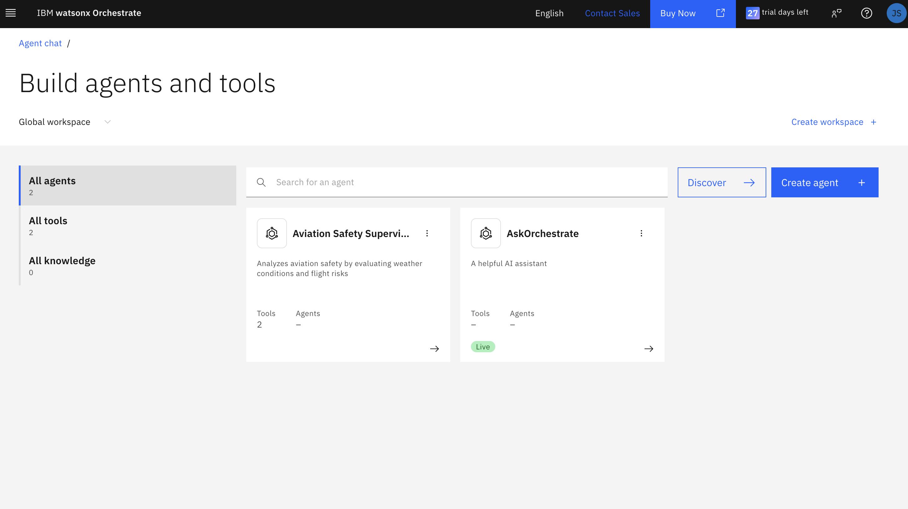

# Lab 3: Building AI Agents with watsonx Orchestrate

**Duration:** 60 minutes  
**Objective:** Create intelligent agents that analyze weather conditions and assess flight risks

---

## Overview

In this lab, you'll:
1. Build a Weather Analysis Tool using watsonx Orchestrate
2. Build a Flight Risk Assessment Tool
3. Test your tools locally
4. Deploy tools to watsonx Orchestrate

---

## Prerequisites

- ✅ Completed Lab 1 (environment setup)
- ✅ Completed Lab 2 (Kafka consumer)
- ✅ Virtual environment activated
- ✅ watsonx Orchestrate credentials configured

---

## Part 1: Understanding Orchestrate Tools (5 min)

### What Are Orchestrate Tools?

Orchestrate tools are Python functions that:
- Use the `@tool()` decorator to expose them to agents
- Have clear input/output schemas (using Pydantic)
- Can be called by AI agents to perform specific tasks
- Run in isolated containers for security

### Tool Structure

```python
from ibm_watsonx_orchestrate.agent_builder.tools import tool
from pydantic import BaseModel, Field

class ToolInput(BaseModel):
    """Define what the tool needs"""
    parameter: str = Field(description="What this parameter does")

class ToolOutput(BaseModel):
    """Define what the tool returns"""
    result: str = Field(description="What this result means")

@tool()
def my_tool(input: ToolInput) -> ToolOutput:
    """
    Clear description of what this tool does.
    The agent uses this to decide when to call the tool.
    """
    # Your logic here
    return ToolOutput(result="something")
```

---

## Part 2: Build Weather Analysis Tool (20 min)

### Step 1: Review the Template

Look at the prebuilt template in `workshop/agents/tool_template.py` to understand the structure.

### Step 2: Create Weather Analysis Tool with Bob

Copy and paste this prompt into IBM Bob:

```bash
Create a file called weather_tool.py in the workshop/agents directory with the following:

1. Import: tool decorator from ibm_watsonx_orchestrate.agent_builder.tools, BaseModel and Field from pydantic

2. Create WeatherInput class (BaseModel) with fields:
   - condition: str (Weather condition type)
   - severity: str (Severity level: Low, Medium, High)
   - visibility_km: float (Visibility in kilometers)
   - wind_speed_kmh: float (Wind speed in km/h)

3. Create WeatherAnalysis class (BaseModel) with fields:
   - risk_level: str (Overall risk: low, medium, high, critical)
   - impact_description: str (Description of aviation impact)
   - recommendations: list[str] (List of safety recommendations)

4. Create analyze_weather_severity function with @tool() decorator:
   - Takes WeatherInput as input
   - Returns WeatherAnalysis
   - Docstring: "Analyzes weather conditions and provides detailed aviation safety assessment. Use this tool when you need to understand the severity and implications of weather conditions."
   
5. Logic for risk_level:
   - If severity is "High" and visibility < 1km: risk_level = "critical"
   - If severity is "High": risk_level = "high"
   - If severity is "Medium": risk_level = "medium"
   - Otherwise: risk_level = "low"

6. Logic for recommendations based on risk_level:
   - critical/high: ["Consider flight delays or cancellations", "Monitor conditions closely", "Prepare alternate routes"]
   - medium: ["Exercise caution", "Monitor weather updates", "Brief crew on conditions"]
   - low: ["Normal operations can continue"]

7. Logic for impact_description:
   - Mention condition type
   - If visibility < 3km, mention "severely reduced visibility"
   - If wind_speed > 40kmh, mention "strong winds"
   - Format: "{condition} with {impacts}"

8. Add if __name__ == "__main__": block to test the tool with sample data:
   - Test with: Thunderstorm, High severity, 2.0km visibility, 55kmh wind
   - Handle the ToolResponse wrapper returned by @tool() decorator
   - Check for common response attributes (data, content, result, output, value)
   - Print the risk_level, impact_description, and recommendations
```

### Step 3: Test Your Weather Tool

Run the tool locally to verify it works.

**If you're still in the `workshop/backend` directory from Lab 2:**

```bash
# Navigate up one level, then into agents
cd ..
cd agents
python weather_tool.py
```

**If you're already in the `workshop` directory:**

```bash
cd agents
python weather_tool.py
```

> 💡 **Tip:** You can check your current directory with `pwd` (Linux/Mac) or `cd` (Windows)

**Expected Output:**
```
============================================================
WEATHER ANALYSIS TEST
============================================================
Result type: ToolResponse
Risk Level: critical
Impact Description: Thunderstorm with severely reduced visibility and strong winds
Recommendations:
  - Consider flight delays or cancellations
  - Monitor conditions closely
  - Prepare alternate routes
============================================================
```

> 💡 **Note:** The `@tool()` decorator wraps the return value in a `ToolResponse` object. The test code handles this by checking for common response attributes to extract the actual `WeatherAnalysis` data.

---

## Part 3: Build Flight Risk Assessment Tool (20 min)

### Step 1: Create Flight Risk Tool with Bob

Copy and paste this prompt into IBM Bob:

```bash
Create a file called flight_tool.py in the workshop/agents directory with the following:

1. Import: tool decorator from ibm_watsonx_orchestrate.agent_builder.tools, BaseModel and Field from pydantic

2. Create FlightRiskInput class (BaseModel) with fields:
   - flight_id: str (Flight identifier)
   - distance_to_hazard_km: float (Distance to weather hazard in km)
   - weather_severity: str (Weather severity: Low, Medium, High)
   - altitude_ft: int (Current altitude in feet)
   - speed_kmh: int (Current speed in km/h)

3. Create FlightRiskAssessment class (BaseModel) with fields:
   - risk_score: float (Risk score from 0-10)
   - recommended_action: str (Action: continue, monitor, divert, delay)
   - reasoning: str (Explanation of the assessment)

4. Create assess_flight_risk function with @tool() decorator:
   - Takes FlightRiskInput as input
   - Returns FlightRiskAssessment
   - Docstring: "Assesses risk level for a flight near a weather hazard and recommends actions. Use this tool to evaluate proximity of flights to weather hazards and provide actionable recommendations."

5. Logic for risk_score calculation (start at 0.0):
   - If distance < 20km: add 5.0
   - Else if distance < 50km: add 3.0
   - Else if distance < 100km: add 1.0
   - If weather_severity is "High": add 4.0
   - If weather_severity is "Medium": add 2.0
   - If weather_severity is "Low": add 0.5
   - If altitude < 10000ft: add 1.0
   - Cap risk_score at 10.0 using min()

6. Logic for recommended_action based on risk_score:
   - If risk_score >= 8: action = "divert"
   - Else if risk_score >= 5: action = "monitor"
   - Else if risk_score >= 3: action = "monitor"
   - Else: action = "continue"

7. Logic for reasoning based on action:
   - divert: "Critical risk: {flight_id} is {distance}km from {severity} severity weather. Immediate diversion recommended."
   - monitor (high risk): "Elevated risk: {flight_id} should be closely monitored. Consider alternate routes."
   - monitor (moderate): "Moderate risk: Continue with caution. Monitor weather updates for {flight_id}."
   - continue: "Low risk: {flight_id} can continue normal operations."

8. Add if __name__ == "__main__": block to test with:
   - flight_id: "AC123"
   - distance_to_hazard_km: 25.0
   - weather_severity: "High"
   - altitude_ft: 35000
   - speed_kmh: 850
   - Handle the ToolResponse wrapper (same as weather tool)
   - Print risk_score, recommended_action, and reasoning
```

### Step 2: Test Your Flight Risk Tool

Run the tool locally.

**If you're in the `workshop/backend` directory:**

```bash
# Navigate up one level, then into agents
cd ..
cd agents
python flight_tool.py
```

**If you're already in the `workshop/agents` directory from testing the weather tool:**

```bash
# You're already in the right place!
python flight_tool.py
```

> 💡 **Tip:** After testing the weather tool, you should already be in `workshop/agents`

**Expected Output:**
```
============================================================
FLIGHT RISK ASSESSMENT TEST
============================================================
Result type: ToolResponse
Risk Score: 9.0/10
Recommended Action: divert
Reasoning: Critical risk: AC123 is 25.0km from High severity weather. Immediate diversion recommended.
============================================================
```

> 💡 **Note:** Like the weather tool, the flight tool also wraps results in a `ToolResponse` object that needs to be handled in the test code.

---

## Part 4: Deploy Tools to watsonx Orchestrate (15 min)

### Step 1: Configure Orchestrate Environment

First, add your watsonx Orchestrate environment to the CLI.

#### Prepare Your Credentials

Before running the command, open your `.env` file in Bob IDE to have your credentials ready:

1. In Bob IDE's file explorer, navigate to `workshop/.env`
2. Click to open the file
3. Find your `ORCHESTRATE_API_URL` and `ORCHESTRATE_API_KEY`
4. Keep this file open for easy copying

> 💡 **Tip:** You'll copy from the `.env` file and paste into the terminal using `Ctrl+Shift+V`

#### Add the Environment

Run this command in your terminal:

```bash
orchestrate env add -n aviation-workshop -u <your-service-instance-url>
```

**Action Items:**

1. Replace `<your-service-instance-url>` with your `ORCHESTRATE_API_URL` from the `.env` file
   - Copy the URL from `.env`: `Ctrl+C`
   - Paste in terminal: `Ctrl+Shift+V`

2. Press Enter

3. You'll see a prompt: **"Please enter your WxO API key:"**

4. Copy your `ORCHESTRATE_API_KEY` from the `.env` file: `Ctrl+C`

5. Paste it in the terminal: `Ctrl+Shift+V`

6. Press Enter

**Expected Output:**
```
Please enter your WxO API key: [your key will be hidden]
Environment 'aviation-workshop' added successfully
```

> 🔒 **Security Note:** Your API key won't be visible when you paste it - this is normal and expected for security.

### Step 2: Activate the Environment

Activate your environment so all commands target it:

```bash
orchestrate env activate aviation-workshop
```

**Expected Output:**
```
Environment 'aviation-workshop' is now active
```

> 💡 **Note:** Authentication expires every 2 hours. If you get authentication errors later, just run `orchestrate env activate aviation-workshop` again.

### Step 3: Verify Environment

Check that your environment is active:

```bash
orchestrate env list
```

You should see `aviation-workshop` marked as active (with an asterisk or highlighted).

### Step 4: Import Weather Tool

```bash
cd workshop/agents
orchestrate tools import -k python -f weather_tool.py
```

**Expected Output:**
```
✅ Tool 'analyze_weather_severity' imported successfully
```

### Step 5: Import Flight Risk Tool

```bash
orchestrate tools import -k python -f flight_tool.py
```

**Expected Output:**
```
✅ Tool 'assess_flight_risk' imported successfully
```

### Step 6: Verify Tools Are Imported

List all your tools:

```bash
orchestrate tools list
```

You should see both tools in the list:
- `analyze_weather_severity`
- `assess_flight_risk`

---

## Part 5: Create a Supervisor Agent

### What Is a Supervisor Agent?

A supervisor agent is an AI-powered coordinator that:
- **Has access to specific tools** - In our case, weather analysis and flight risk assessment
- **Uses an LLM to decide which tools to call** - Intelligently determines when to analyze weather vs. assess flight risk
- **Can reason about complex problems** - Correlates data from multiple sources
- **Provides intelligent responses** - Synthesizes information into actionable recommendations

### How the Aviation Supervisor Works

The Aviation Safety Supervisor agent acts as an intelligent coordinator that:

1. **Receives input** about weather conditions and flight positions
2. **Analyzes weather severity** using the `analyze_weather_severity` tool
3. **Assesses flight risk** using the `assess_flight_risk` tool by calculating proximity to hazards
4. **Correlates the data** - Combines weather severity with flight proximity to understand the complete picture
5. **Provides recommendations** - Synthesizes both analyses into clear, actionable safety guidance

**Example Workflow:**
```
User Query: "Thunderstorm near Toronto, Flight AC123 is 25km away"
    ↓
Agent calls analyze_weather_severity
    → Returns: "Critical risk, reduced visibility, strong winds"
    ↓
Agent calls assess_flight_risk
    → Returns: "Risk score 9.0/10, recommend divert"
    ↓
Agent synthesizes both results
    → "Critical situation: Flight AC123 should divert immediately due to
       severe weather conditions and close proximity to hazard"
```

This correlation of real-time weather data with flight telemetry is what makes the system intelligent and actionable!

### Create Agent Configuration with Bob

Copy and paste this prompt into IBM Bob:

```bash
Create a file called supervisor_agent.yaml in the workshop/agents directory with the following YAML structure:

spec_version: v1
kind: native
name: aviation_supervisor
display_name: Aviation Safety Supervisor
description: |
  Analyzes aviation safety by evaluating weather conditions and flight risks
llm: groq/openai/gpt-oss-120b
style: react
tools:
  - analyze_weather_severity
  - assess_flight_risk
instructions: |
  You are an aviation safety supervisor. Your role is to:
  1. Analyze weather conditions using the weather analysis tool
  2. Assess flight risks using the flight risk assessment tool
  3. Provide clear, actionable safety recommendations
  4. Prioritize passenger safety above all else
  
  When given weather and flight information:
  - First analyze the weather severity
  - Then assess the flight risk based on proximity
  - Provide a comprehensive safety assessment
  - Be clear and direct in your recommendations
```

### Import the Agent

```bash
cd workshop/agents
orchestrate agents import -f supervisor_agent.yaml
```

**Expected Output:**
```
✅ Agent 'aviation_supervisor' imported successfully
```

---

## Testing Your Agent in Orchestrate UI (Bonus)

Now let's test your agent in the watsonx Orchestrate web interface!

### Step 1: Access IBM Cloud

1. Open **Firefox** in your VM (or your local browser if running locally)

2. Navigate to **IBM Cloud**: [https://cloud.ibm.com](https://cloud.ibm.com)

3. Log in with your IBM ID credentials

4. Click the **hamburger menu (☰)** in the top-left corner

5. Select **"Resource list"**

### Step 2: Launch watsonx Orchestrate

You'll see your watsonx Orchestrate instance in the resource list:



**Action Items:**

1. Find **"watsonx Orchestrate"** in your resource list

2. Click on the instance name

3. Click **"Launch watsonx Orchestrate"** button

### Step 3: Navigate to Agents

After launching, you'll see the watsonx Orchestrate main page:



**Action Items:**

1. Look at the **bottom-left corner** of the page

2. Click **"Manage agents"**

### Step 4: Find Your Agent

You'll now see the Agents management page:



**Action Items:**

1. Look for your **"Aviation Safety Supervisor"** agent in the list

2. Click on the agent name to open it

### Step 5: Chat with Your Agent

Once you open the agent, you'll see a chat interface.

**Try this test query:**

```
Analyze this situation:
- Weather: Thunderstorm with High severity, 2km visibility, 55km/h winds
- Flight AC123 is 25km away at 35000ft altitude

What should we do?
```

**What to expect:**

The agent should:
1. ✅ Call the `analyze_weather_severity` tool
2. ✅ Call the `assess_flight_risk` tool
3. ✅ Provide a comprehensive safety recommendation
4. ✅ Suggest specific actions (e.g., divert, monitor, delay)

**Example Response:**

The agent might say something like:

> "Based on my analysis:
>
> **Weather Analysis:** The thunderstorm presents critical risk with severely reduced visibility (2km) and strong winds (55km/h).
>
> **Flight Risk Assessment:** Flight AC123 is at high risk being only 25km from the hazard. Risk score: 9.0/10.
>
> **Recommendation:** Immediate diversion is recommended. The flight is too close to critical weather conditions. Consider alternate routes and monitor conditions closely."

> 💡 **Tip:** You can see which tools the agent called by looking at the conversation - Orchestrate shows tool invocations in the chat.

---

## Troubleshooting

### Issue: "Module not found" when testing locally

**Solution:**
```bash
# Make sure you're in the agents directory
cd workshop/agents

# Make sure venv is activated
source ../venv/bin/activate  # or ..\venv\Scripts\activate on Windows

# Run the tool
python weather_tool.py
```

### Issue: Tool import fails

**Checklist:**
- [ ] Is your Orchestrate API key correct in `.env`?
- [ ] Are you in the correct directory?
- [ ] Does the Python file have syntax errors?

**Solution:**
```bash
# Test your Orchestrate connection
orchestrate --version

# Check for Python syntax errors
python -m py_compile weather_tool.py
```

### Issue: Agent can't find tools

**Solution:**
```bash
# List all tools to verify they're imported
orchestrate tools list

# If missing, re-import
orchestrate tools import -k python -f weather_tool.py
orchestrate tools import -k python -f flight_tool.py
```

---

## Verification Checklist

Before moving to Lab 4, ensure you:

- [ ] Created `weather_tool.py` with weather analysis logic
- [ ] Created `flight_tool.py` with risk assessment logic
- [ ] Tested both tools locally and they work
- [ ] Imported both tools to watsonx Orchestrate
- [ ] Verified tools appear in `orchestrate tools list`
- [ ] (Optional) Created and imported supervisor agent
- [ ] (Optional) Tested agent in Orchestrate UI

---

## What You Learned

✅ **Orchestrate Tool Development**
- Creating tools with `@tool()` decorator
- Defining input/output schemas with Pydantic
- Writing clear docstrings for agent understanding

✅ **Business Logic Implementation**
- Risk assessment algorithms
- Conditional logic for recommendations
- Structured output formatting

✅ **Orchestrate CLI**
- Importing tools to Orchestrate
- Managing tools and agents
- Testing and verification

---

## Next Steps

🎉 **Excellent work!** You've built intelligent AI agents!

In **Lab 4**, you'll create a dashboard to:
- Visualize flights and weather on a map
- Display real-time alerts
- Show agent recommendations
- Provide an interactive interface

---

## Quick Reference

**Test Tools Locally:**
```bash
cd workshop/agents
python weather_tool.py
python flight_tool.py
```

**Import Tools:**
```bash
orchestrate tools import -k python -f weather_tool.py
orchestrate tools import -k python -f flight_tool.py
```

**List Tools:**
```bash
orchestrate tools list
```

**Import Agent:**
```bash
orchestrate agents import -f supervisor_agent.yaml
```

---

**Lab 3 Complete!** 🤖✨